# OpenSWMM GeoPackage – Entity Relationship Diagram

> Auto-generated by `python/generate_geopackage_erd.py`  
> Source: `src/engine/input/geopackage/GeoPackageSchema.cpp`

```mermaid
erDiagram

    %% ── OGC GeoPackage Standard ──
    gpkg_spatial_ref_sys {
        int srs_id PK
        string srs_name
        string organization
        int organization_coordsys_id
        string definition
        string description
    }

    gpkg_contents {
        string table_name PK
        string data_type
        string identifier
        string description
        string last_change
        float min_x
        float min_y
        float max_x
        float max_y
        int srs_id FK
    }

    gpkg_geometry_columns {
        string table_name PK,FK
        string column_name PK
        string geometry_type_name
        int srs_id FK
        int z
        int m
    }

    %% ── Part B – Simulation Results ──
    simulations {
        string simulation_id PK
        string name
        string description
        string created_at
        string engine_version
        string engine_build
        string start_date
        string end_date
        float report_step
        float wet_step
        float dry_step
        float routing_step
        string routing_model
        string inp_hash
        string status
        float elapsed_wall_time
        float continuity_error_runoff
        float continuity_error_flow
        float continuity_error_quality
    }

    %% ── Part A – Model Input ──
    options {
        string simulation_id PK,FK
        string key PK
        string value
    }

    nodes {
        int fid PK
        string simulation_id FK
        string node_id
        string node_type
        blob geom
        float invert_elev
        float max_depth
        float init_depth
        float surcharge_depth
        float ponded_area
        string tag
    }

    storages {
        string simulation_id PK,FK
        string node_id PK,FK
        string curve_name
        float a
        float b
        float c
        float seep_rate
        float evap_frac
        float exfil_suction
        float exfil_ksat
        float exfil_imd
    }

    outfalls {
        string simulation_id PK,FK
        string node_id PK,FK
        string outfall_type
        float param
        int has_flap_gate
        string route_to
    }

    dividers {
        string simulation_id PK,FK
        string node_id PK,FK
        string divider_type
        float cutoff
        float cd
        float max_depth
        string curve_name
        string divider_link
    }

    links {
        int fid PK
        string simulation_id FK
        string link_id
        string link_type
        blob geom
        string from_node FK
        string to_node FK
        float offset1
        float offset2
        float q0
        float q_limit
        int direction
        string xsect_shape
        float xsect_geom1
        float xsect_geom2
        float xsect_geom3
        float xsect_geom4
        string xsect_curve FK
        int has_flap_gate
        string tag
    }

    conduits {
        string simulation_id PK,FK
        string link_id PK,FK
        float roughness
        float length
        int xsect_barrels
        int xsect_culvert
        float loss_inlet
        float loss_outlet
        float loss_avg
        float seep_rate
    }

    pumps {
        string simulation_id PK,FK
        string link_id PK,FK
        string pump_curve FK
        float init_state
        float startup_depth
        float shutoff_depth
    }

    orifices {
        string simulation_id PK,FK
        string link_id PK,FK
        string orientation
        float discharge_coeff
        float orate
    }

    weirs {
        string simulation_id PK,FK
        string link_id PK,FK
        string weir_type
        float discharge_coeff
        float crest_height
        int end_contractions
    }

    outlets {
        string simulation_id PK,FK
        string link_id PK,FK
        string rating_type
        string rating_curve FK
        float q_coeff
        float q_expon
        float crest_height
    }

    subcatchments {
        int fid PK
        string simulation_id FK
        string subcatch_id
        blob geom
        string outlet_node FK
        string outlet_subcatch FK
        string rain_gage FK
        float area
        float width
        float slope
        float curb_length
        float frac_imperv
        float n_imperv
        float n_perv
        float ds_imperv
        float ds_perv
        float pct_zero_imperv
        string subarea_routing
        float pct_routed
        string infil_model
        float infil_p1
        float infil_p2
        float infil_p3
        float infil_p4
        float infil_p5
        string tag
    }

    rain_gages {
        int fid PK
        string simulation_id FK
        string gage_id
        blob geom
        string rain_type
        string rain_interval
        float snow_catch
        string data_source
        string source_name
        string station_id
        string rain_units
    }

    %% ── Part A – Network Topology ──
    node_links {
        int fid PK
        string simulation_id FK
        string link_id FK
        string from_node FK
        string to_node FK
        string link_type
        int direction
    }

    subcatch_routing {
        int fid PK
        string simulation_id FK
        string subcatch_id FK
        string outlet_type
        string outlet_node FK
        string outlet_subcatch FK
    }

    %% ── Part A – Input Data ──
    curves {
        int fid PK
        string simulation_id FK
        string curve_id
        string curve_type
        float x_value
        float y_value
        int ordinal
    }

    input_timeseries {
        int fid PK
        string simulation_id FK
        string series_id
        string timestamp
        float value
        int ordinal
    }

    patterns {
        int fid PK
        string simulation_id FK
        string pattern_id
        string pattern_type
        int ordinal
        float factor
    }

    inflows {
        int fid PK
        string simulation_id FK
        string node_id FK
        string constituent
        string timeseries
        string inflow_type
        float m_factor
        float s_factor
        float baseline
        string pattern
    }

    dwf_inflows {
        int fid PK
        string simulation_id FK
        string node_id FK
        string constituent
        float avg_value
        string pat1
        string pat2
        string pat3
        string pat4
    }

    control_rules {
        int fid PK
        string simulation_id FK
        int ordinal
        string rule_text
    }

    %% ── Part A – Climate/Hydrology ──
    evaporation {
        int fid PK
        string simulation_id FK
        string evap_type
        string evap_values
        string ts_name FK
        string pan_coeff
        string recovery_pat FK
        int dry_only
    }

    climate_settings {
        int fid PK
        string simulation_id FK
        string temp_source
        string temp_ts_name FK
        string temp_file
        float temp_file_start
        string wind_type
        string wind_speed
        float snow_divt
        float snow_ati_wt
        float snow_nrg_ratio
        float snow_lat
        float snow_min_melt
        float snow_max_melt
        string adc_imperv
        string adc_perv
    }

    snowpacks {
        int fid PK
        string simulation_id FK
        string snowpack_id
        string surface_type
        float p1
        float p2
        float p3
        float p4
        float p5
        float p6
        float p7
        string removal_subcatch FK
    }

    adjustments {
        int fid PK
        string simulation_id FK
        string adjust_type
        string adj_values
    }

    subcatch_adjustments {
        int fid PK
        string simulation_id FK
        string subcatch_id FK
        string adjust_type
        string pattern_id FK
    }

    %% ── Part A – Water Quality ──
    pollutants {
        int fid PK
        string simulation_id FK
        string pollutant_id
        string units
        float rain_conc
        float gw_conc
        float ii_conc
        float decay_coeff
        int snow_only
        string co_pollutant FK
        float co_fraction
    }

    treatment {
        int fid PK
        string simulation_id FK
        string node_id FK
        string pollutant_id FK
        string expression
    }

    %% ── Part A – LID ──
    lid_controls {
        int fid PK
        string simulation_id FK
        string lid_id
        string layer_type
        float p1
        float p2
        float p3
        float p4
        float p5
        float p6
        float p7
    }

    lid_usage {
        int fid PK
        string simulation_id FK
        string subcatch_id FK
        string lid_id FK
        int number
        float area
        float width
        float init_sat
        float from_imperv
        int to_perv
        string rpt_file
        string drain_to FK
        float from_perv
    }

    %% ── Part A – RDII ──
    rdii_assignments {
        int fid PK
        string simulation_id FK
        string node_name FK
        string uh_name FK
        float sewer_area
    }

    unit_hydrographs {
        int fid PK
        string simulation_id FK
        string uh_name
        string gage_name FK
        string month
        string response
        float r
        float t
        float k
        float dmax
        float drecov
        float dinit
    }

    %% ── Part A – Geometry ──
    transects {
        int fid PK
        string simulation_id FK
        string transect_id
        int ordinal
        float station
        float elevation
        float n_left
        float n_right
        float n_channel
        float x_left_bank
        float x_right_bank
        float x_left_encroach
        float x_right_encroach
        float x_factor
        float y_factor
        float length_factor
        string comment
    }

    %% ── Part B – Simulation Results ──
    variables {
        int variable_id PK
        string name
        string object_type
        string category
        string units
        string description
    }

    result_timeseries {
        string simulation_id FK
        string object_type
        string object_id
        int variable_id FK
        float elapsed_time
        float value
    }

    result_summary {
        string simulation_id PK,FK
        string object_type PK
        string object_id PK
        int variable_id PK,FK
        float value
    }

    %% ── Part C – Observed Data ──
    observed_series {
        int series_id PK
        string name
        string description
        string source
        string source_id
        int variable_id FK
        string object_type
        string object_id
        string units
        string time_zone
        string collection_method
        string start_date
        string end_date
        int record_count
    }

    observed_values {
        int series_id FK
        string timestamp
        float value
        string quality_flag
        string qualifier
    }

    %% ── Relationships ──
    gpkg_spatial_ref_sys ||--o{ gpkg_contents : "references SRS"
    gpkg_contents ||--o{ gpkg_geometry_columns : "describes table"
    gpkg_spatial_ref_sys ||--o{ gpkg_geometry_columns : "references SRS"
    simulations ||--o{ options : "belongs to"
    simulations ||--o{ nodes : "belongs to"
    simulations ||--o{ links : "belongs to"
    simulations ||--o{ subcatchments : "belongs to"
    simulations ||--o{ rain_gages : "belongs to"
    simulations ||--o{ node_links : "belongs to"
    simulations ||--o{ subcatch_routing : "belongs to"
    simulations ||--o{ curves : "belongs to"
    simulations ||--o{ input_timeseries : "belongs to"
    simulations ||--o{ patterns : "belongs to"
    simulations ||--o{ evaporation : "belongs to"
    simulations ||--o{ climate_settings : "belongs to"
    simulations ||--o{ snowpacks : "belongs to"
    simulations ||--o{ adjustments : "belongs to"
    simulations ||--o{ subcatch_adjustments : "belongs to"
    simulations ||--o{ pollutants : "belongs to"
    simulations ||--o{ lid_controls : "belongs to"
    simulations ||--o{ lid_usage : "belongs to"
    simulations ||--o{ rdii_assignments : "belongs to"
    simulations ||--o{ unit_hydrographs : "belongs to"
    simulations ||--o{ treatment : "belongs to"
    simulations ||--o{ transects : "belongs to"
    simulations ||--o{ inflows : "belongs to"
    simulations ||--o{ dwf_inflows : "belongs to"
    simulations ||--o{ control_rules : "belongs to"
    nodes ||--o{ storages : "storage subtype"
    nodes ||--o{ outfalls : "outfall subtype"
    nodes ||--o{ dividers : "divider subtype"
    nodes ||--o{ inflows : "inflow at node"
    nodes ||--o{ dwf_inflows : "DWF at node"
    links ||--o{ conduits : "conduit subtype"
    links ||--o{ pumps : "pump subtype"
    links ||--o{ orifices : "orifice subtype"
    links ||--o{ weirs : "weir subtype"
    links ||--o{ outlets : "outlet subtype"
    nodes ||--o{ links : "from node"
    nodes ||--o{ links : "to node"
    curves ||--o{ links : "uses curve"
    curves ||--o{ pumps : "pump curve"
    curves ||--o{ outlets : "rating curve"
    links ||--o{ node_links : "mirrors link"
    nodes ||--o{ node_links : "from node"
    nodes ||--o{ node_links : "to node"
    rain_gages ||--o{ subcatchments : "uses gage"
    nodes ||--o{ subcatchments : "drains to"
    subcatchments ||--o{ subcatch_routing : "routes"
    nodes ||--o{ subcatch_routing : "outlet node"
    subcatchments ||--o{ subcatch_routing : "outlet subcatch"
    subcatchments ||--o{ subcatch_adjustments : "adjusts"
    patterns ||--o{ subcatch_adjustments : "uses pattern"
    input_timeseries ||--o{ evaporation : "uses timeseries"
    patterns ||--o{ evaporation : "uses pattern"
    input_timeseries ||--o{ climate_settings : "uses timeseries"
    subcatchments ||--o{ snowpacks : "removes to"
    nodes ||--o{ treatment : "applied at node"
    pollutants ||--o{ treatment : "treats"
    pollutants ||--o{ pollutants : "co-pollutant"
    subcatchments ||--o{ lid_usage : "placed in"
    lid_controls ||--o{ lid_usage : "uses control"
    nodes ||--o{ lid_usage : "drains to"
    nodes ||--o{ rdii_assignments : "assigned to"
    unit_hydrographs ||--o{ rdii_assignments : "uses UH"
    rain_gages ||--o{ unit_hydrographs : "uses gage"
    simulations ||--o{ result_timeseries : "reports for"
    variables ||--o{ result_timeseries : "measures"
    simulations ||--o{ result_summary : "reports for"
    variables ||--o{ result_summary : "measures"
    variables ||--o{ observed_series : "measures"
    observed_series ||--o{ observed_values : "belongs to"
```

## Tables by Group

### OGC GeoPackage Standard

- `gpkg_spatial_ref_sys`
- `gpkg_contents`
- `gpkg_geometry_columns`

### Part B – Simulation Results

- `simulations`
- `variables`
- `result_timeseries`
- `result_summary`

### Part A – Model Input

- `options`
- `nodes`
- `storages`
- `outfalls`
- `dividers`
- `links`
- `conduits`
- `pumps`
- `orifices`
- `weirs`
- `outlets`
- `subcatchments`
- `rain_gages`

### Part A – Network Topology

- `node_links`
- `subcatch_routing`

### Part A – Input Data

- `curves`
- `input_timeseries`
- `patterns`
- `inflows`
- `dwf_inflows`
- `control_rules`

### Part A – Climate/Hydrology

- `evaporation`
- `climate_settings`
- `snowpacks`
- `adjustments`
- `subcatch_adjustments`

### Part A – Water Quality

- `pollutants`
- `treatment`

### Part A – LID

- `lid_controls`
- `lid_usage`

### Part A – RDII

- `rdii_assignments`
- `unit_hydrographs`

### Part A – Geometry

- `transects`

### Part C – Observed Data

- `observed_series`
- `observed_values`
